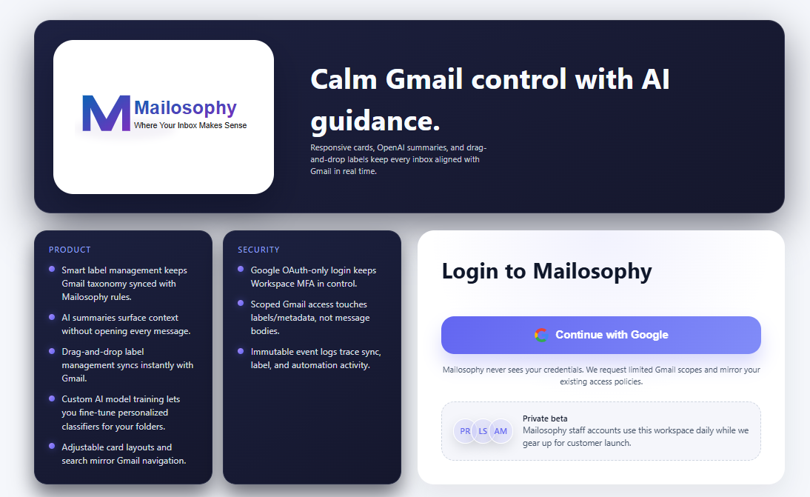
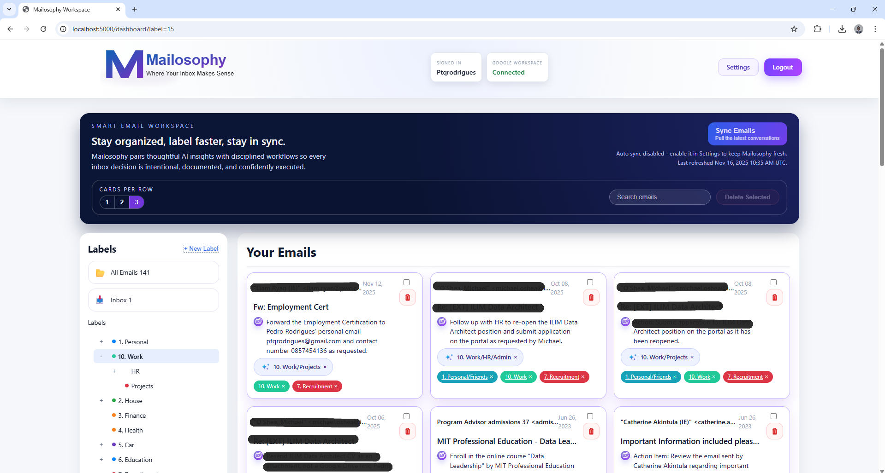
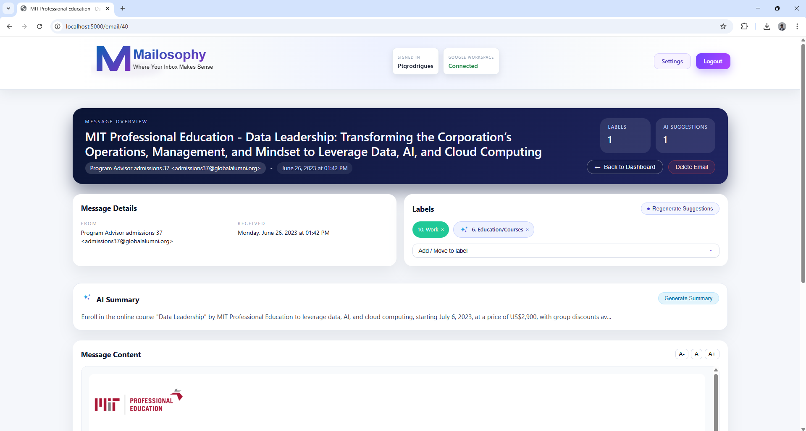

# Mailosophy - Email Organization Web Application


A modern web application that blends Gmail automation with AI-powered summaries and label suggestions so teams can triage every inbox with confidence.

## Features
### Product & Custom AI
- Login page now highlights the Custom AI Model offering right alongside product/security cards so visitors see the feature before authenticating.
- The login hero references the AI model as part of the product narrative and points to the documentation for generating summaries post-login.


**Email Management**
- Card-based dashboard with adjustable 1–3 column layouts, search, pagination, and quick All/Inboxes shortcuts
- Multi-select with bulk delete plus per-email delete (mirrors Gmail trash)
- Email detail page redesigned to match the dashboard style with structured metadata and footer actions

**Intelligent Labeling**
- Hierarchical label tree synced from Gmail (system folders hidden or relocated automatically)
- Drag-and-drop single or multi-selected emails onto labels; Inbox is removed automatically unless you opt out
- Label dropdown in the detail view mirrors the tree logic and syncs changes back to Gmail instantly

**User Accounts & Access**
- Google OAuth-only login; every action runs on behalf of the signed-in Google Workspace user
- Settings page for personal preferences (auto-sync cadence, Inbox retention toggle, drag-and-drop behavior)
- Admin console for tenant-wide Gmail/OpenAI configuration and user-scoped maintenance commands

**Modern Interface**
- Sticky header with brand mark, live status cards, and quick actions (Settings, Admin, Logout)
- Hero banner with workflow messaging, auto-sync status, and toolbar for layout/search/bulk delete
- Responsive CSS design system applied consistently across dashboard, email detail, admin, and settings

**AI Workflows**
- OpenAI-powered summaries replace raw body previews and now render directly beneath the message details with the AI-label icon to highlight their provenance.
- AI suggestions reuse that same icon so both cards and the detail view feel consistent, and clicking a chip applies exactly that label to Gmail.
- Custom AI model training surfaces fine-tuned classifiers and is highlighted on the login hero as part of the product experience.
- Clicking an AI chip applies the label immediately and syncs it to Gmail; Inbox retention obeys user preference

**Automation & Sync**
- Manual sync with streaming Server-Sent Events feedback (connecting, processing, cleaning, etc.)
- Optional auto sync every _n_ minutes per user; runs silently and updates the "last refreshed" banner text
- Label refresh is part of every sync; drag-and-drop/manual label changes notify Gmail in real time

## Tech Stack

- **Backend**: Python (Flask) with Blueprints, Flask-Login, Flask-WTF, and streaming SSE endpoints
- **Database**: SQLAlchemy ORM on SQLite (default) with lightweight migration helper (`scripts/upgrade_schema.py`)
- **Frontend**: Jinja2 templates, custom CSS design system, and vanilla JavaScript modules (`dashboard.js`, etc.)
- **AI**: OpenAI API for label suggestions + card summaries, with heuristics in `app/utils/ai_labeler.py`
- **Integrations**: Google OAuth 2.0 + Gmail API (labels, message fetch, trash, drag-and-drop syncing)

## Installation

### Prerequisites
- Python 3.8+
- `pip`
- Google Cloud project with Gmail API enabled

### Setup

1. Clone the repository and move into the folder:
   ```bash
   git clone <repo-url>
   cd Mailosophy
   ```
2. Create and activate a virtual environment:
   ```bash
   python -m venv venv
   # Windows
   venv\Scripts\activate
   # macOS/Linux
   source venv/bin/activate
   ```
3. Install dependencies:
   ```bash
   pip install -r requirements.txt
   ```
4. Copy the example environment file and update the values:
   ```bash
   cp .env.example .env
   ```
   Key variables:
   ```
   FLASK_APP=main.py
   FLASK_ENV=development
   SECRET_KEY=your-secret-key-here
   DATABASE_URL=sqlite:///Mailosophy.db
   GOOGLE_CLIENT_ID=...
   GOOGLE_CLIENT_SECRET=...
   GOOGLE_REDIRECT_URI=http://localhost:5000/auth/google/callback
   OPENAI_API_KEY=...
   ```
5. Run the lightweight schema upgrade (creates/updates tables such as `users.last_synced_at`):
   ```bash
   python scripts/upgrade_schema.py
   ```

## Running the Application

```bash
python main.py
```

Visit `http://localhost:5000` and sign in with Google to begin.

## Usage

### Signing In
1. Click **Continue with Google** on the login screen.
2. Approve the Gmail/Workspace scopes.
3. You are redirected to the dashboard once OAuth succeeds.

### Syncing Emails
1. Press **Sync Emails** on the hero banner.
2. Watch the real-time progress messages (connecting, fetching, cleaning, etc.).
3. Enable auto sync in **Settings ? Preferences & Automation** to run silent refreshes every _n_ minutes.
4. The hero status pill displays whether auto sync is enabled and when the last sync finished.

### Managing Labels
1. Browse the Gmail label tree in the sidebar (Inbox lives outside the tree for clarity).
2. Click **+ New Label** to create custom tags; they sync to Gmail immediately.
3. Drag and drop one or many emails onto a label to move them and (optionally) remove Inbox.
4. Use the email detail dropdown to add/remove labels with the same logic as the tree.

### AI Suggestions
1. Open any message and click **Generate Suggestions** on the detail page or on a card.
2. AI chips appear both on the detail view and on the dashboard cards.
3. Click a chip to apply that label; Gmail is updated instantly.
4. Card summaries are AI-authored so you can triage without opening every email, with cached summaries reloaded on page load and refreshable via the “Generate Summary” button.

### Finding & Acting on Mail
- Use the search input for sender/subject/content queries.
- Filter by label nodes or use the All/Inbox quick cards.
- Adjust **Cards per row** (1/2/3) to match your screen width.
- Multi-select emails to delete them in bulk (deletions sync to Gmail trash).

### Settings & Admin
- **Settings**: configure auto-sync cadence, Inbox retention for manual labels, drag-and-drop rules, delete confirmation toggles, and other user-specific options.

## Project Structure

```
Mailosophy/
+-- app/
¦   +-- __init__.py            # Flask app factory
¦   +-- routes.py              # Blueprints (main, auth, email, label)
¦   +-- models/                # SQLAlchemy models (user, email, label, app_config)
¦   +-- utils/                 # Gmail helper, AI labeler, OpenAI helper, celery utils
¦   +-- templates/             # base.html, dashboard.html, email_detail.html, admin.html, etc.
¦   +-- static/                # css/style.css, js/dashboard.js, img/logo.svg, ai-label.svg, ...
+-- scripts/
¦   +-- upgrade_schema.py      # Lightweight migration helper
+-- docs/                      # Setup guides, OAuth walkthroughs, implementation summary
+-- backups/                   # Reference copies (pre-IMAP removal)
+-- main.py                    # Application entry point
+-- requirements.txt           # Python dependencies
+-- .env / .env.example        # Environment configuration
+-- README.md
```

## Features Coming Soon
- Attachment viewer and Gmail thread context
- Inline reply/forward powered by Gmail send scopes
- Notification center for AI and sync events
- Advanced filtering (date ranges, AI confidence, label combos)
- Team workspaces with audit trails

## API Endpoints (Highlights)
- `GET /auth/login` – Google OAuth entry point
- `GET /auth/logout` – Sign out
- `GET /dashboard` – Main UI (server-rendered)
- `POST /email/sync` – SSE endpoint to sync Gmail messages
- `POST /email/<id>/labels` – Assign labels (also triggered via drag-and-drop/AJAX)
- `DELETE /email/<id>/labels/<label_id>` – Remove labels
- `POST /email/<id>/delete` – Trash an email in Gmail and the local DB
- `POST /labels/create` – Create custom labels and sync to Gmail

(Additional admin/settings endpoints exist but are primarily exercised through the UI.)

## Troubleshooting

**"Email sync not working"**
- Ensure you are signed in with Google (banner shows connection status).
- Re-run the Google OAuth flow if you see `401 Invalid Credentials` (token revoked).
- Check server logs for Gmail quota errors or OpenAI failures.
- Verify `.env` contains valid OpenAI + Google credentials and that `scripts/upgrade_schema.py` has been run.

## Contributing
Pull requests and issue reports are welcome! Please open an issue first if you plan a large change.

## License
MIT License.

## Support
Need help or have ideas? Open an issue in this repository.
## Screenshots
Credit the updated UI with sanitized imagery captured locally under . The example below uses placeholder filenames and masked email addresses (e.g., ) to avoid leaking real data:

1. **Landing + login view** – marketing hero, security callouts, and the Google-first CTA.
   
2. **Dashboard + detail view** – dashboard yield with label tree, AI chips, and the new summary panel, with sensitive headers hidden.
   

3. **Email detail panel** – AI summary card, label picker, and header metadata with masked senders.
   
## Troubleshooting
